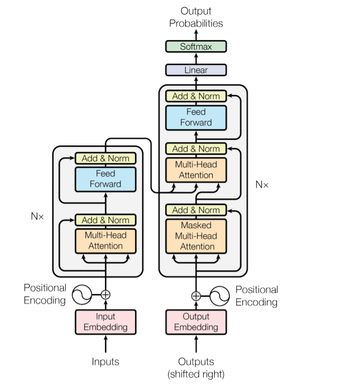

# (tiny) Generatively Pretrained Transformer


> Author: Daniel Barahona, 2023

An implementation of GPT: the Generatively Pretrained Transformer, just to learn how it works. Its architecture is the following:



GPT uses the concepts of "self-attention" and residual blocks to learn to predict "tokens" (which in this example are just characters) based on a chunk of previous tokens. For example, after the chunk "Shakespear", it should learn that it is highly probable that the next token will be "e".

To run the script for training with a file (Unix):

```
python3 tinyGPT.py -f data/input.txt -i 5000
```

Where `-f` is the file with the training contents, and `-i` is the number of training iterations to perform.

And to run the script for generating some text:

```
python3 tinyGPT.py --generate 1000 --file data/quijote.txt
```

Where `-f` was the file used during the training phase and `--generate` is the number of characters to generate.

***

### References

Vaswani, A., Shazeer, N., Parmar, N., Uszkoreit, J., Jones, L., Gomez, A.N., Kaiser, Ł. and Polosukhin, I., 2017. *Attention is all you need*. Advances in neural information processing systems, 30. <a href="https://arxiv.org/abs/1706.03762" target="_blank">Link</a>

He, K., Zhang, X., Ren, S. and Sun, J., 2016. *Deep residual learning for image recognition*. In Proceedings of the IEEE conference on computer vision and pattern recognition (pp. 770-778). <a href="https://arxiv.org/abs/1512.03385" target="_blank">Link</a>